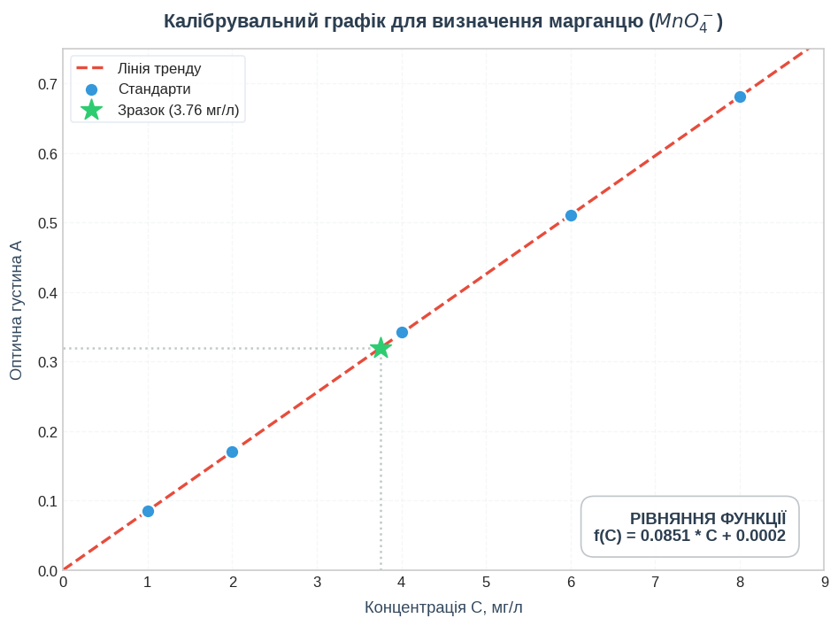
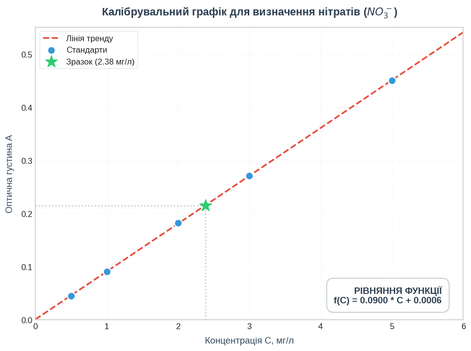
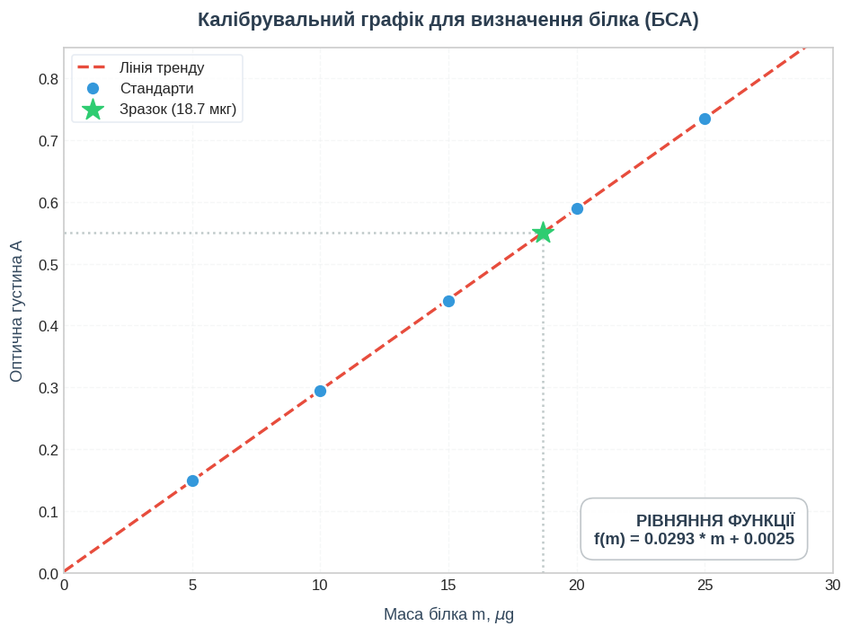
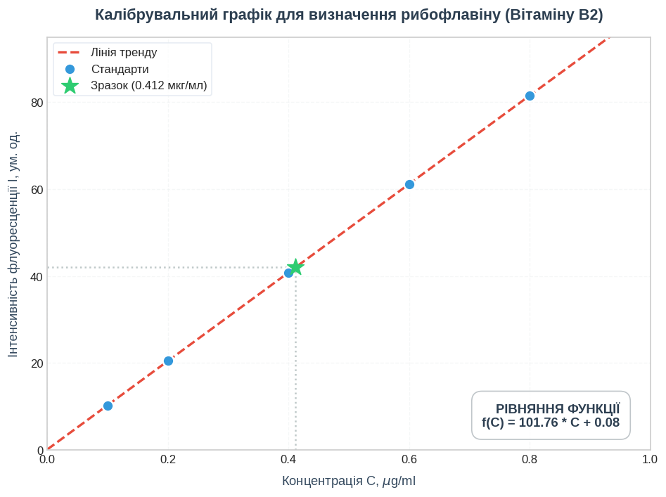
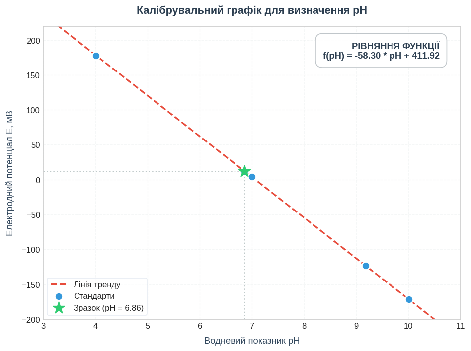

#  Практикум Основи лабораторних досліджень: Розрахунок буферних розчинів та калібрувальних графіків

---

##  Категорія 1: Розрахунок буферних розчинів

Усі розрахунки в цій категорії базуються на рівнянні Гендерсона-Хассельбаха для кислотних та основних буферних систем.

### 1. Розрахунок $pH$ ацетатного буфера

* **Теоретичне обґрунтування:** Буферний розчин складається зі слабкої кислоти ($CH_3COOH$) та її солі ($CH_3COONa$). Для обчислення його водневого показника використовується рівняння Гендерсона-Хассельбаха:
  
  $$pH = pK_a + \lg\left(\frac{n_{\text{солі}}}{n_{\text{кислоти}}}\right)$$
  
  *(Примітка: оскільки кислота і сіль містяться в одному загальному об'ємі розчину, співвідношення молярних концентрацій $\frac{C_{\text{солі}}}{C_{\text{кислоти}}}$ дорівнює співвідношению кількостей речовин $\frac{n_{\text{солі}}}{n_{\text{кислоти}}}$).*

* **Крок 1: Обчислення показника константи кислотності ($pK_a$).**
  
  $$pK_a = -\lg(K_a) = -\lg(1.76 \times 10^{-5})$$
  
  Використовуючи властивості логарифмів $\lg(a \times 10^{-b}) = b - \lg(a)$, отримуємо:
  
  $$pK_a = 5 - \lg(1.76) \approx 5 - 0.2455 = 4.7545 \approx 4.75$$

* **Крок 2: Знаходження кількості речовини ($n$) компонентів буфера.**
  * Для кислоти: $n_{\text{кислоти}} = C_{\text{кислоти}} \times V_{\text{кислоти}} = 0.1 \text{ моль/л} \times 0.1 \text{ л} = 0.01 \text{ моль}$
  * Для солі: $n_{\text{солі}} = C_{\text{солі}} \times V_{\text{солі}} = 0.2 \text{ моль/л} \times 0.2 \text{ л} = 0.04 \text{ моль}$

* **Крок 3: Підстановка даних у рівняння.**
  
  $$pH = 4.75 + \lg\left(\frac{0.04 \text{ моль}}{0.01 \text{ моль}}\right) = 4.75 + \lg(4)$$
  
  Оскільки $\lg(4) \approx 0.602$, отримуємо:
  
  $$pH = 4.75 + 0.60 = 5.35$$

* **Відповідь:** $pH = 5.35$

---

### 2. Приготування буфера з заданим $pH$

* **Постановка завдання:** Необхідно дізнатися, яку кількість солі слід додати до відомої кількості кислоти, щоб досягти бажаного значення $pH$.

* **Крок 1: Розрахунок кількості речовини мурашиної кислоти ($n_{\text{кислоти}}$).**
  Об'єм переводимо в літри ($500 \text{ мл} = 0.5 \text{ л}$):
  $$n_{\text{кислоти}} = C \times V = 0.2 \text{ моль/л} \times 0.5 \text{ л} = 0.1 \text{ моль}$$

* **Крок 2: Знаходження необхідного співвідношення компонентів.**
  Підставляємо відомі величини $pH$ та $pK_a$ у рівняння Гендерсона-Хассельбаха:
  $$4.05 = 3.75 + \lg\left(\frac{n_{\text{солі}}}{0.1}\right)$$
  Переносимо $pK_a$ у ліву частину:
  $$\lg\left(\frac{n_{\text{солі}}}{0.1}\right) = 4.05 - 3.75 = 0.30$$

* **Крок 3: Потенціювання (позбавлення від логарифма).**
  Якщо $\lg(X) = 0.30$, то $X = 10^{0.30}$. Знайдемо значення:
  $$\frac{n_{\text{солі}}}{0.1} = 10^{0.30} \approx 1.995 \approx 2.0$$

* **Крок 4: Розрахунок кількості молів та маси солі ($m$).**
  $$n_{\text{солі}} = 2.0 \times 0.1 \text{ моль} = 0.2 \text{ моль}$$
  Маса солі дорівнює добутку кількості речовини на молярну масу ($m = n \times M$):
  $$m = 0.2 \text{ моль} \times 68 \text{ г/моль} = 13.6 \text{ г}$$

* **Відповідь:** Необхідна маса форміату натрію — $13.6 \text{ г}$.

---

### 3. Зміна $pH$ при додаванні сильної кислоти

* **Хімічна суть процесу:** При додаванні сильної кислоти ($HCl$) до ацетатного буфера іони $H^+$ вступають у реакцію нейтралізації з компонентом, що відповідає за зв'язування кислоти — ацетат-іонами (сіллю):
  $$CH_3COONa + HCl \rightarrow CH_3COOH + NaCl$$
  В результаті кількість солі зменшується, а кількість слабкої оцтової кислоти зростає на ту саму величину (на $0.01 \text{ моль}$).

* **Крок 1: Розрахунок початкового $pH$ розчину.**
  $$pH_{\text{поч}} = 4.75 + \lg\left(\frac{0.1 \text{ моль}}{0.1 \text{ моль}}\right) = 4.75 + \lg(1) = 4.75 + 0 = 4.75$$

* **Крок 2: Обчислення кількості речовини компонентів після реакції.**
  * Нова кількість солі: $n_{\text{солі}} = 0.1 - 0.01 = 0.09 \text{ моль}$
  * Нова кількість кислоти: $n_{\text{кислоти}} = 0.1 + 0.01 = 0.11 \text{ моль}$

* **Крок 3: Розрахунок кінцевого $pH$ розчину.**
  $$pH_{\text{кінц}} = 4.75 + \lg\left(\frac{0.09}{0.11}\right) = 4.75 + \lg(0.818)$$
  Знаходимо логарифм дробу ($\lg(0.818) \approx -0.087 \approx -0.09$):
  $$pH_{\text{кінц}} = 4.75 - 0.09 = 4.66$$

* **Крок 4: Розрахунок зміни $\Delta pH$.**
  $$\Delta pH = |pH_{\text{кінц}} - pH_{\text{поч}}| = |4.66 - 4.75| = 0.09$$

* **Відповідь:** Значення $pH$ зменшиться на $0.09$ і становитиме $4.66$.

---

### 4. Розрахунок аміачного буфера (основний буфер)

* **Теоретичне обґрунтування:** Аміачний буфер утворений слабкою основою ($NH_3$) та її сіллю ($NH_4Cl$). Для основних буферів рівняння Гендерсона-Хассельбаха спочатку розраховує показник лужності ($pOH$):
  $$pOH = pK_b + \lg\left(\frac{C_{\text{солі}}}{C_{\text{основи}}}\right)$$

* **Крок 1: Розрахунок $pOH$.**
  Підставляємо концентрації солі ($0.35 \text{ М}$) та аміаку ($0.15 \text{ М}$):
  $$pOH = 4.75 + \lg\left(\frac{0.35}{0.15}\right) = 4.75 + \lg(2.333)$$
  Знаходимо логарифм ($\lg(2.333) \approx 0.368 \approx 0.37$):
  $$pOH = 4.75 + 0.37 = 5.12$$

* **Крок 2: Перехід від $pOH$ до $pH$.**
  У водних розчинах за стандартної температури $25^\circ\text{C}$ сума водневого та гідроксидного показників є сталою величиною: $pH + pOH = 14$.
  $$pH = 14 - pOH = 14 - 5.12 = 8.88$$

* **Відповідь:** $pH = 8.88$

---

### 5. Обчислення буферної ємності

* **Теоретичне обґрунтування:** Буферна ємність ($B$) — це здатність розчину протидіяти зміні $pH$. Вона вимірюється кількістю еквівалентів сильної кислоти або лугу, яку потрібно додати до $1 \text{ л}$ буфера, щоб змінити його $pH$ рівно на одиницю:
  $$B = \frac{\Delta n}{\Delta pH \times V}$$
  де $\Delta n$ — кількість моль доданого лугу чи кислоти, $\Delta pH$ — абсолютна зміна $pH$, $V$ — об'єм буферного розчину в літрах.

* **Крок 1: Розрахунок зміни водневого показника ($\Delta pH$).**
  $$\Delta pH = 7.39 - 7.21 = 0.18$$

* **Крок 2: Розрахунок буферної ємності.**
  Підставляємо всі дані у формулу:
  $$B = \frac{0.02 \text{ моль}}{0.18 \times 1 \text{ л}} = \frac{0.02}{0.18} = \frac{1}{9} \approx 0.111 \text{ моль/(л} \cdot \Delta pH)$$

* **Відповідь:** Буферна ємність $B = 0.111 \text{ моль/(л} \cdot \Delta pH)$.

---

##  Категорія 2: Побудова калібрувального графіка

Усі завдання базуються на законі Бугера-Ламберта-Бера та методі лінійної регресії ($Y = mX + b$).

### 1. Розрахунок невідомої концентрації за оптичною густиною

* **Математичний зміст:** Маємо рівняння прямої лінії у вигляді $A = m \cdot C + b$, де $A$ — оптична густина, $C$ — шукана концентрація, $m = 0.0851$ — кутовий коефіцієнт (нахил прямої), а $b = 0.0002$ — вільний член (фонове поглинання або зсув нуля приладу).

* **Крок 1: Підстановка виміряного значення в рівняння регресії.**
  
  $$0.320 = 0.0851 \cdot C + 0.0002$$

* **Крок 2: Алгебраїчне вираження невідомого $C$.** Переносимо вільний член у ліву частину з протилежним знаком:
  
  $$0.0851 \cdot C = 0.320 - 0.0002$$
  $$0.0851 \cdot C = 0.3198$$

* **Крок 3: Обчислення кінцевого результату.**
  
  $$C = \frac{0.3198}{0.0851} \approx 3.76 \text{ мг/л}$$

* **Відповідь:** Концентрація марганцю становить 3.76 мг/л.
---

### 2. Побудова графіка та розрахунок коефіцієнта нахилу

* **Теоретичне обґрунтування:** У фотометрії, якщо розчин підпорядковується закону Бера, калібрувальна пряма виходить із початку координат $(0,0)$. Для спрощеного методу найменших квадратів (МНК) кутовий коефіцієнт $m$ обчислюється за формулою:
  $$m = \frac{\sum (C_i \cdot A_i)}{\sum (C_i^2)}$$

* **Крок 1: Розрахунок проміжних добутків та квадратів для кожної точки (складання таблиці МНК).**

| Точка $i$ | Концентрація $C_i$ | Оптична густина $A_i$ | Добуток $C_i \cdot A_i$ | Квадрат $C_i^2$ |
| :---: | :---: | :---: | :---: | :---: |
| 1 | 1 | 0.15 | $1 \times 0.15 = 0.15$ | $1^2 = 1$ |
| 2 | 2 | 0.29 | $2 \times 0.29 = 0.58$ | $2^2 = 4$ |
| 3 | 3 | 0.46 | $3 \times 0.46 = 1.38$ | $3^2 = 9$ |
| 4 | 4 | 0.59 | $4 \times 0.59 = 2.36$ | $4^2 = 16$ |
| **Суми ($\sum$)** | — | — | **4.47** | **30** |

* **Крок 2: Обчислення кутового коефіцієнта.**
  $$m = \frac{4.47}{30} = 0.149 \text{ л/мг}$$

* **Відповідь:** Кутовий коефіцієнт $m = 0.149$, отримане рівняння калібрувального графіка: $A = 0.149 \cdot C$.

---

### 3. Врахування розведення при роботі з графіком

* **Практичний контекст:** У лабораторіях досліджувані зразки (особливо стічні води) часто є надто концентрованими — їхня оптична густина виходить за межі лінійної ділянки калібрувального графіка. Тому зразок розводять у мірній колбі.

* **Крок 1: Розрахунок фактора розведення ($F$).**
  Фактор розведення показує, у скільки разів зменшилася концентрація зразка після додавання розчинника:
  $$F = \frac{V_{\text{кінцевий}}}{V_{\text{аліквоти}}} = \frac{100 \text{ мл}}{10 \text{ мл}} = 10$$

* **Крок 2: Обчислення дійсної концентрації у вихідній пробі ($C_{\text{вих}}$).**
  Концентрація, знайдена за графіком для розведеного розчину в кюветі ($C_{\text{кювети}}$), дорівнює $4.2 \text{ мг/л}$. Щоб дізнатися вихідну концентрацію, множимо її на фактор розведення:
  $$C_{\text{вих}} = C_{\text{кювети}} \times F = 4.2 \text{ мг/л} \times 10 = 42 \text{ мг/л}$$

* **Відповідь:** Концентрація міді у стічній воді — $42 \text{ мг/л}$.

---

### 4. Знаходження вмісту речовини у масових відсотках

* **Комплексне завдання:** Поєднує інструментальний аналіз (фотометрію) та класичні розрахунки масової частки в аналітичній хімії.

* **Крок 1: Знаходження концентрації заліза в приготованому розчині ($C$).**
  Використовуємо рівняння калібрувального графіка $A = 0.700 \cdot C$:
  $$C = \frac{A}{0.700} = \frac{0.350}{0.700} = 0.5 \text{ г/л}$$

* **Крок 2: Розрахунок маси заліза ($m_{\text{Fe}}$) у мірній колбі.**
  Концентрація $0.5 \text{ г/л}$ означає, що в $1000 \text{ мл}$ міститься $0.5 \text{ г}$ заліза. У нашому випадку загальний об'єм розчину після розчинення наважки руди становить $250 \text{ мл}$ ($0.25 \text{ л}$):
  $$m_{\text{Fe}} = C \times V = 0.5 \text{ г/л} \times 0.25 \text{ л} = 0.125 \text{ г}$$

* **Крок 3: Обчислення масової частки заліза в руді ($\omega$).**
  Масова частка дорівнює відношенню знайденої маси заліза до загальної маси вихідної наважки руди, помноженому на $100\%$:
  $$\omega = \left(\frac{m_{\text{Fe}}}{m_{\text{наважки}}}\right) \times 100\% = \left(\frac{0.125 \text{ г}}{0.500 \text{ г}}\right) \times 100\% = 0.25 \times 100\% = 25\%$$

* **Відповідь:** Масова частка заліза в руді становить $25\%$.

---

### 5. Визначення молярного коефіцієнта поглинання

* **Теоретичне обґрунтування:** Основний закон світлопоглинання (Бугера-Ламберта-Бера) пов'язує оптичну густину $A$ з концентрацією:
  $$A = \varepsilon \cdot l \cdot C$$
  де $\varepsilon$ — молярний коефіцієнт світлопоглинання (екстинкції); $l$ — товщина поглинального шару (довжина кювети, см); $C$ — молярна концентрація розчину (моль/л).

* **Крок 1: Співставлення рівнянь.**
  Нам дано рівняння калібрувальної прямої: $A = 1500 \cdot C$. Порівняємо його із законом Бера:
  $$\varepsilon \cdot l = 1500$$

* **Крок 2: Знаходження значення $\varepsilon$.**
  Оскільки товщина кювети за умовами задачі $l = 2 \text{ см}$, підставляємо це значення:
  $$\varepsilon \times 2 \text{ см} = 1500 \text{ л/моль}$$
  $$\varepsilon = \frac{1500}{2} = 750 \text{ л/(моль} \cdot \text{см)}$$

* **Відповідь:** Молярний коефіцієнт поглинання $\varepsilon = 750 \text{ л/(моль} \cdot \text{см)}$.

---

## Категорія 3: задачі, створених саме для самостійної побудови калібрувального графіка з реальними масивами експериментальних даних

---

##  Задача 1. Визначення концентрації марганцю ($MnO_4^-$)

###  Умова задачі
Для побудови калібрувального графіка фотометра виміряли оптичну густину ($A$) п'яти стандартних розчинів перманганату калію ($KMnO_4$) різної концентрації ($C$, мг/л) у кюветі з товщиною поглинального шару $l = 1$ см. Необхідно знайти вміст марганцю в стічній воді, якщо її виміряна оптична густина становить:
$$A_{\text{досл}} = 0.320$$

###  Експериментальні дані та МНК-аналіз

| Точка ($i$) | Концентрація $C_i$ (мг/л) | Оптична густина $A_i$ | Добуток $C_i \cdot A_i$ | Квадрат $C_i^2$ |
| :---: | :---: | :---: | :---: | :---: |
| 1 | 1.0 | 0.085 | 0.085 | 1.0 |
| 2 | 2.0 | 0.170 | 0.340 | 4.0 |
| 3 | 4.0 | 0.342 | 1.368 | 16.0 |
| 4 | 6.0 | 0.510 | 3.060 | 36.0 |
| 5 | 8.0 | 0.681 | 5.448 | 64.0 |
| **Сума ($\sum$)** | **21.0** | **1.788** | **10.301** | **121.0** |

###  Математичний розв'язок та візуалізація
За результатами прецизійного лінійного регресійного аналізу отримано калібрувальне рівняння:
$$A = 0.0851 \cdot C + 0.0002$$

Обчислення невідомої концентрації для $A_{\text{досл}} = 0.320$:
$$0.320 = 0.0851 \cdot C + 0.0002 \implies 0.0851 \cdot C = 0.3198 \implies C = \frac{0.3198}{0.0851} \approx 3.76 \text{ мг/л}$$

* **Відповідь:** Концентрація марганцю становить **3.76 мг/л**.

---

##  Задача 2. Аналіз нітратів у питній воді (Фотометрія)

###  Умова задачі
Побудуйте калібрувальну криву для визначення нітрат-іонів ($NO_3^-$) за реакцією з саліцилатом натрію. Використовуючи отриманий графік, визначте концентрацію нітратів у колодязній воді, якщо виміряне значення оптичної густини становить:
$$A_{\text{досл}} = 0.215$$

###  Експериментальні дані та МНК-аналіз

| Точка ($i$) | Концентрація $C_i$ (мг/л) | Оптична густина $A_i$ | Добуток $C_i \cdot A_i$ | Квадрат $C_i^2$ |
| :---: | :---: | :---: | :---: | :---: |
| 1 | 0.5 | 0.045 | 0.0225 | 0.25 |
| 2 | 1.0 | 0.090 | 0.0900 | 1.00 |
| 3 | 2.0 | 0.182 | 0.3640 | 4.00 |
| 4 | 3.0 | 0.271 | 0.8130 | 9.00 |
| 5 | 5.0 | 0.450 | 2.2500 | 25.00 |
| **Сума ($\sum$)** | **11.5** | **1.038** | **3.5395** | **39.25** |

###  Математичний розв'язок та візуалізація
За результатами прецизійного лінійного регресійного аналізу отримано калібрувальне рівняння:
$$A = 0.0900 \cdot C + 0.0006$$

Обчислення невідомої концентрації для $A_{\text{досл}} = 0.215$:
$$0.215 = 0.0900 \cdot C + 0.0006 \implies 0.0900 \cdot C = 0.2144 \implies C = \frac{0.2144}{0.0900} \approx 2.38 \text{ мг/л}$$

* **Відповідь:** Концентрація нітратів становить **2.38 мг/л**.

---

##  Задача 3. Визначення білка за методом Бредфорд

###  Умова задачі
У біохімічній лабораторії для калібрування спектрофотометра використали стандартні розчини сироваткового альбуміну (БСА). Побудуйте лінійний графік залежності поглинання від маси білка ($m$, мкг). Яка маса білка міститься в аналізованій пробі клітинного лізату, якщо прилад показав:
$$A_{\text{досл}} = 0.550$$

###  Експериментальні дані та МНК-аналіз

| Точка ($i$) | Маса білка $m_i$ (мкг) | Оптична густина $A_i$ | Добуток $m_i \cdot A_i$ | Квадрат $m_i^2$ |
| :---: | :---: | :---: | :---: | :---: |
| 1 | 5 | 0.150 | 0.750 | 25 |
| 2 | 10 | 0.295 | 2.950 | 100 |
| 3 | 15 | 0.440 | 6.600 | 225 |
| 4 | 20 | 0.590 | 11.800 | 400 |
| 5 | 25 | 0.735 | 18.375 | 625 |
| **Сума ($\sum$)** | **75** | **2.210** | **40.475** | **1375** |

###  Математичний розв'язок та візуалізація
За результатами прецизійного лінійного регресійного аналізу отримано калібрувальне рівняння:
$$A = 0.0293 \cdot m + 0.0025$$

Обчислення маси білка для $A_{\text{досл}} = 0.550$:
$$0.550 = 0.0293 \cdot m + 0.0025 \implies 0.0293 \cdot m = 0.5475 \implies m = \frac{0.5475}{0.0293} \approx 18.7 \text{ мкг}$$

* **Відповідь:** Маса білка в досліджуваній пробі становить **18.7 мкг**.

---

##  Задача 4. Залежність інтенсивності флуоресценції від вмісту рибофлавіну

###  Умова задачі
Для визначення вітаміну $B_2$ (рибофлавіну) методом флуориметрії виміряли інтенсивність світіння ($I$, умовні одиниці) серії стандартів. Побудуйте калібрувальний графік у координатах $I - C$. Визначте вміст вітаміну в розчині, якщо його інтенсивність флуоресценції становить:
$$I_{\text{досл}} = 42.0$$

###  Експериментальні дані та МНК-аналіз

| Точка ($i$) | Концентрація $C_i$ (мкг/мл) | Інтенсивність $I_i$ | Добуток $C_i \cdot I_i$ | Квадрат $C_i^2$ |
| :---: | :---: | :---: | :---: | :---: |
| 1 | 0.1 | 10.22 | 1.022 | 0.01 |
| 2 | 0.2 | 20.54 | 4.108 | 0.04 |
| 3 | 0.4 | 40.86 | 16.344 | 0.16 |
| 4 | 0.6 | 61.18 | 36.708 | 0.36 |
| 5 | 0.8 | 81.50 | 65.200 | 0.64 |
| **Сума ($\sum$)** | **2.1** | **214.30** | **123.382** | **1.21** |

###  Математичний розв'язок та візуалізація
За результатами прецизійного лінійного регресійного аналізу отримано калібрувальне рівняння:
$$I = 101.76 \cdot C + 0.08$$

Обчислення невідомої концентрації для $I_{\text{досл}} = 42.0$:
$$42.0 = 101.76 \cdot C + 0.08 \implies 101.76 \cdot C = 41.92 \implies C = \frac{41.92}{101.76} \approx 0.412 \text{ мкг/мл}$$

* **Відповідь:** Концентрація рибофлавіну становить **0.412 мкг/мл**.

---

##  Задача 5. Потенціометричне визначення pH (Калібрування електрода)

###  Умова задачі
Для калібрування pH-метра виміряли електродний потенціал ($E$, мВ) скляного електрода в п'яти стандартних буферних розчинах. Побудуйте графік залежності $E$ від $pH$. Визначте $pH$ дослідного соку, якщо потенціал електрода в ньому склав:
$$E_{\text{досл}} = +12.0 \text{ мВ}$$

###  Експериментальні дані та МНК-аналіз

| Точка ($i$) | Значення $pH_i$ | Потенціал $E_i$ (мВ) | Добуток $pH_i \cdot E_i$ | Квадрат $pH_i^2$ |
| :---: | :---: | :---: | :---: | :---: |
| 1 | 4.01 | 178.0 | 713.78 | 16.0801 |
| 2 | 6.86 | 12.0 | 82.32 | 47.0596 |
| 3 | 7.00 | 4.0 | 28.00 | 49.0000 |
| 4 | 9.18 | -123.0 | -1129.14 | 84.2724 |
| 5 | 10.01 | -172.0 | -1721.72 | 100.2001 |
| **Сума ($\sum$)** | **37.06** | **-101.0** | **-2026.76** | **296.6122** |

###  Математичний розв'язок та візуалізація
За результатами прецизійного лінійного регресійного аналізу отримано калібрувальне рівняння:
$$E = -58.30 \cdot pH + 411.92$$

Обчислення pH дослідного соку для $E_{\text{досл}} = 12.0 \text{ мВ}$:
$$12.0 = -58.30 \cdot pH + 411.92 \implies -58.30 \cdot pH = -399.92 \implies pH = \frac{-399.92}{-58.30} \approx 6.86$$

* **Відповідь:** Значення pH дослідного соку становить **6.86**.
